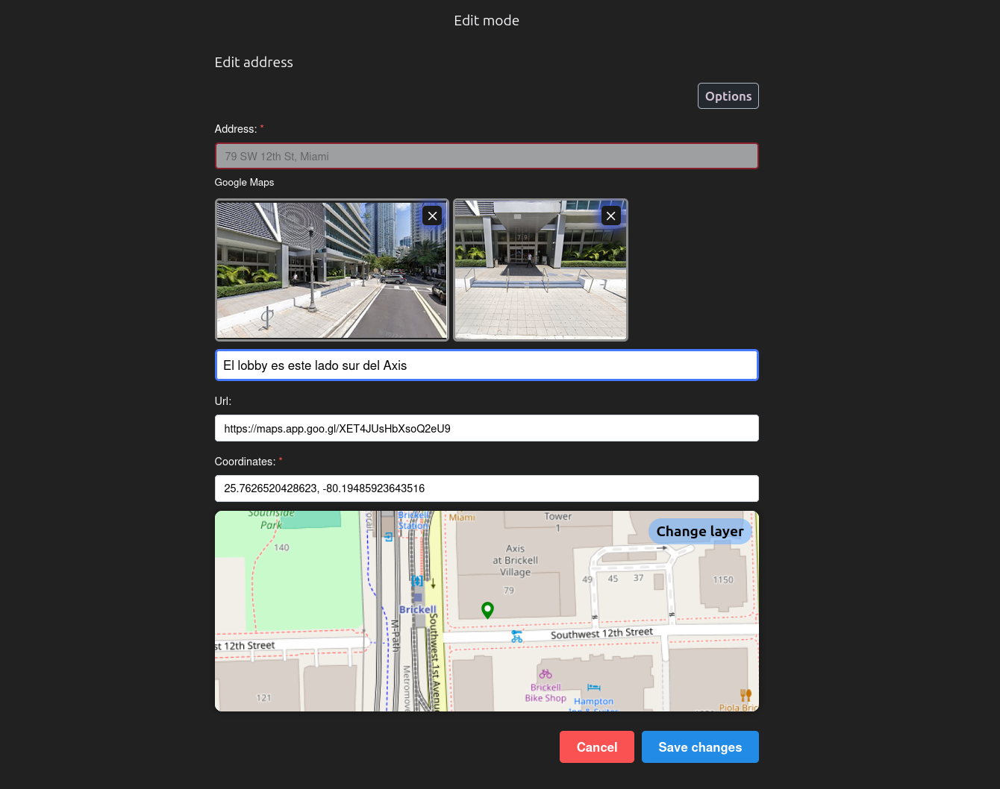
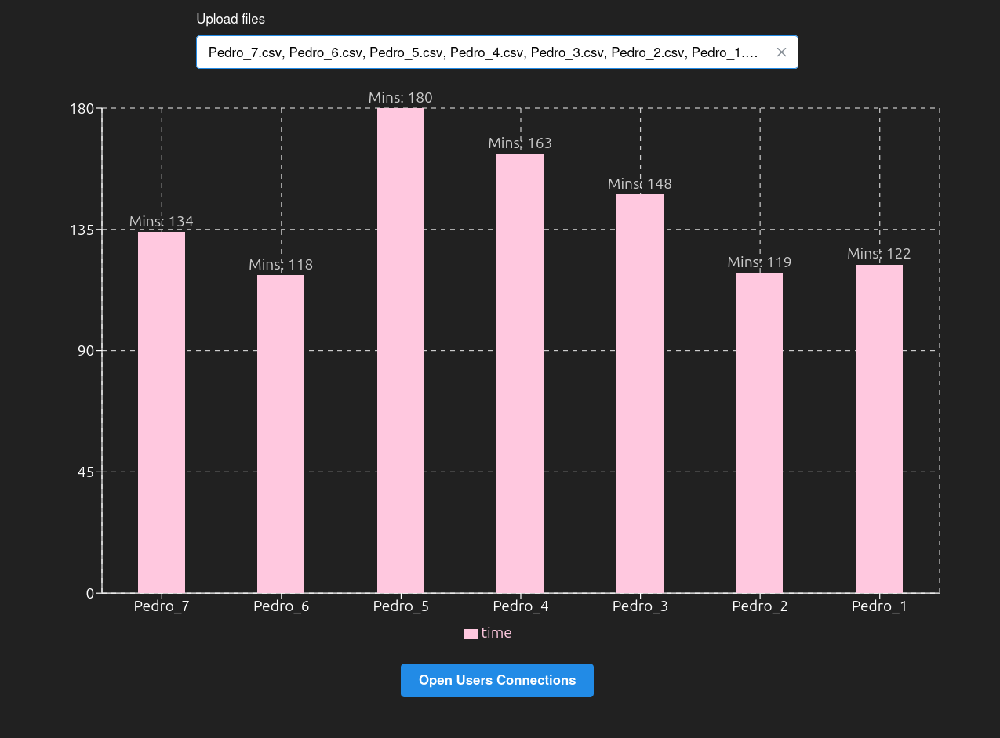
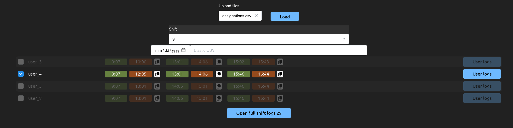
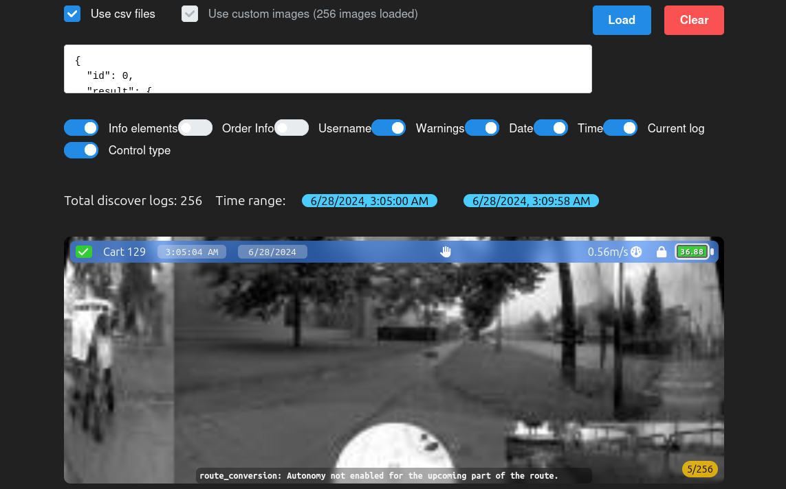

# Kirby tools

Is a webapp tool which i used to manage my work in the company. Since it requires to intercept some Elastic requests with specific data, it's not possible to use it outside the company or on a different context. I will provide sanitized files to make it work as intended.

```
npm i
npm run dev
```

Note: Since the Elastic request couldn't be intercepted in mobile platforms, this app is not intended to be used in mobile devices and is not responsive by default.

Note: The app uses Google Sing In to authenticate users, but refresh token suppont has not been added yet, so the user will need to login every time the session expires.

## Some of the used libraries

- React + Typescript
- Leaflet
- Zustand
- Tailwind
- ...others :)

### Deployed at

https://kirby-tools.netlify.app/

### Tools

- [x] Address
- [ ] Operations
- [ ] Networks
- [ ] Observance mode
- [x] Order viewer
- [x] Operator worked time
- [x] Assignations
- [x] Logs Player

### Address

Allows to add or edit address in the database for the specified operation. This is consumed by an Firefox extension to refine the delivery point since the povided by the client is not accurate.

<!-- Image of the tool ./kirby-address-edit.png -->



### Order viewer

Used to see the info of an specified order id, fron the raw data, the route, handovers and also generates Elastic links with useful queries in the relevant events of the order like each status change. It can also show anomalies in the order.

### User connections

Based on the logs of an operator, it calculates the worked time given the `.csv` file(s) containing a shift connection logs. It is spected to be used with multiple files to compare and detect anomalies.



### Assignations

Given a `.csv` file with the assignations and shifts of all day, it generates the elements to check if the operator has the correct assignation and shift, this in order to detect anomalies such ignoring the assignation or having the wrong shift.



### Logs Player

Requires to intercept an Elastic bsearch request without compression and save the response as a `.json` file. The logs are setup to be saved each ~2 seconds and the response limit is of 500.
The player has options to change the speed, show or hide some data and also to save the images if required for further usage due to the images being deleted in the server after some time.



#### Files

- User connections: https://drive.google.com/file/d/1u3cNql8mpAPq4Y6-YgZaCMu-8LHevw1W
- Assignments: https://drive.google.com/file/d/1eTWkFcOX8h7qNCOMO45ckevxv2KZ93GJ
- Logs Player:
  - Logs.json: https://drive.google.com/file/d/1il6GpogLMUfn0dj1I9piS8A_gQ6mCisL
  - Images: https://drive.google.com/file/d/1OoG_R9_E8baKRtAgMn6kdb3JjrUBTTYZ
